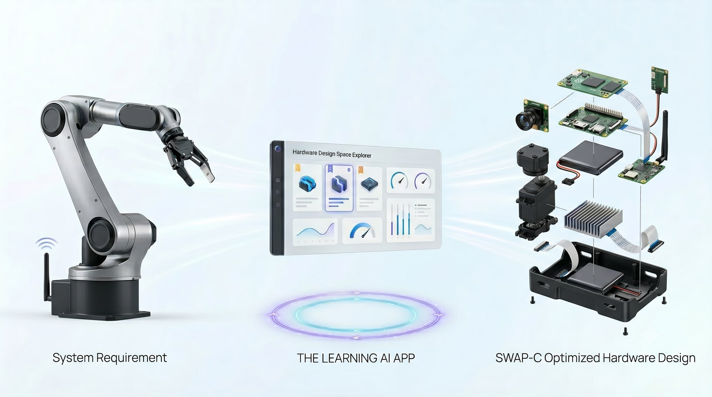
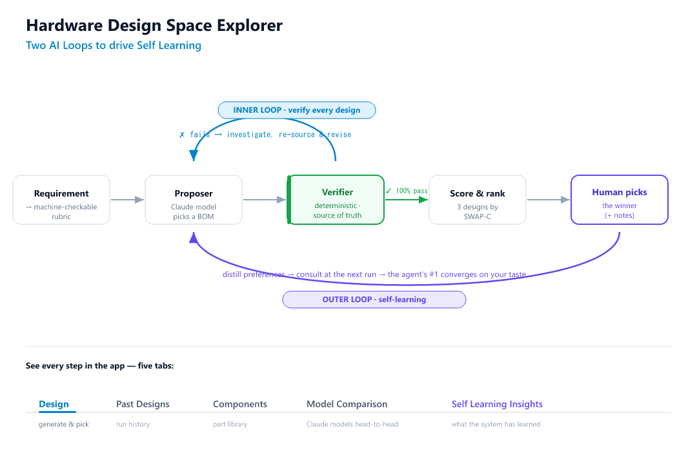

# Hardware System Explorer

> Give it a hardware requirement. Get **three complete, verified designs** — each tuned to a different trade-off — ranked, with the work shown live. Pick a winner, and the system **learns your taste** for next time.

### ▶ Live demo — **https://hardware-system-explorer.vercel.app**





---

## The problem

Specifying hardware means balancing **SWAP-C** — **S**ize, **W**eight, **P**ower, **C**ost — against dozens of hard constraints. There is rarely one right answer; there are *trade-offs*, and the right one depends on engineering judgment. Tools that emit a single answer hide that judgment. This one surfaces it: **choice, with evidence — then it learns from the choice.**

## What it does

1. Turns a plain-English requirement into a **machine-checkable rubric**.
2. Generates **three complete designs**, each optimized for a different SWAP-C profile:
   - **Efficiency** — lowest power, longest runtime
   - **Compact** — smallest, lightest
   - **Value** — cheapest, fastest to source
3. **Gates every design with a deterministic verifier** — *never the LLM* — against every hard constraint, then ranks the three with a transparent scorecard.
4. A **human picks the winner** (or rejects all three) with optional notes.
5. The choice is **distilled into durable preferences** that reshape the next run's ranking. Over time, the agent's #1 **converges on your taste**.
6. Every backend action **streams live** so you can watch the work happen.

## The two loops

The diagram above is the whole system. Two loops, cleanly separated:

- **Inner loop — verification.** The proposer (a Claude model) picks a bill of materials; the **verifier** checks it against every hard constraint. On failure it feeds the specific failures back, the proposer re-sources and revises, and it repeats until **100% of hard constraints pass**. The **verifier is the single source of truth** — the LLM never decides pass/fail.
- **Outer loop — self-learning.** The human picks a winner; the system distills that decision into **preferences** and consults them at the start of the next run. Preferences only ever reshape *soft* ranking weights — they can **reorder feasible designs, but never admit an infeasible one.**

## Why it's different

- **Choice with evidence, not a single answer.** Three ranked alternatives, each gated identically, each with a normalized SWAP-C scorecard and a per-constraint checklist.
- **A verifier you can trust.** Real deterministic engineering checks — power budget, peak-power rails (P=I·V), voltage-rail coverage, endurance (Wh / avg W), thermal, mass, size/packing, compute (TOPS + RAM), sensing, comms, actuation (incl. stall current), connector mating, IP rating — with a **pass + fail unit test for every constraint**.
- **It gets better the more you use it.** Disagreement is the strongest signal; the **agreement rate trends up** as the agent learns what you actually choose.
- **The work is watchable.** A live **System Logs** stream shows every provider query, part selected, constraint flipped red→green, and swap that lands.

## The app

Five tabs:

| Tab | What it shows |
| --- | --- |
| **Design** | Requirement intake, the three designs side-by-side (scorecards + bills of materials), the live System Logs, and the choice bar. |
| **Past Designs** | Every run — the three designs, the human's pick, and the full replayable log. |
| **Components** | The growing library of every real part the engine has discovered, with provenance. |
| **Model Comparison** | How the different Claude models compare at producing the best designs — same requirement, different model. |
| **Self Learning Insights** | The decision timeline, the learned ranking weights, and side-by-side *agent #1 vs human pick* examples that show *why* each shift happened. |

## Tech

- **Next.js 15** (App Router) + TypeScript — a single deployable app; backend logic in pure TS modules exposed via route handlers.
- **Deterministic verifier** (source of truth) + **LLM proposer** (Claude), behind a pluggable **provider layer** (curated KB / web search / Rapidflare catalog).
- **Live telemetry** over Server-Sent Events.
- **Durable store** abstraction: **Postgres (Supabase)** in production, file-based locally — so decisions and preferences survive across deploys.
- Deployed on **Vercel**.

## Run locally

```bash
npm install
npm run dev      # http://localhost:3000
npm test         # verifier unit tests + the golden run
npm run golden   # CI gate: 3 ranked feasible designs + a decision that reorders the next run
```

All API keys are **optional** and degrade gracefully:

| Var | Effect |
| --- | --- |
| `ANTHROPIC_API_KEY` | enables the Claude proposer + web-search provider (absent → deterministic proposer + KB only) |
| `POSTGRES_URL` | durable Postgres store (Supabase pooler URL) instead of local files |
| `RAPIDFLARE_API_KEY` | activates the Rapidflare component provider |

## The guarantee

The **verifier** — never the LLM, never a learned preference — decides every pass/fail. Always. Learned preferences only reorder *feasible* designs; they can never admit an infeasible one. The system never fabricates a passing design — an infeasible profile is reported honestly, with the specific failing constraint.

## Demo

[](https://www.youtube.com/watch?v=6HP6mD0-3xo)

▶ **[Watch the 1-minute demo on YouTube](https://www.youtube.com/watch?v=6HP6mD0-3xo)**

---

<sub>Built with [Claude Code](https://claude.com/claude-code).</sub>
